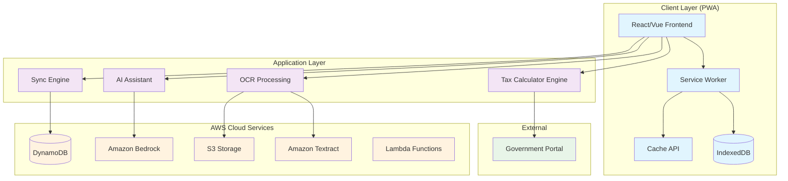

# Design Document: Bharat Tax Mitra

## Overview

Bharat Tax Mitra is a Progressive Web App (PWA) designed to democratize tax preparation for salaried individuals across India. The system combines offline-first architecture with cloud-based AI assistance to provide reliable tax calculations, educational guidance, and filing automation while handling the connectivity challenges of diverse Indian markets.

The architecture prioritizes data privacy, cost efficiency, and accessibility, ensuring users can prepare their taxes safely regardless of their technical expertise or network conditions.

## Architecture

### High-Level Architecture



### Offline-First Architecture

The system implements a robust offline-first pattern:

1. **Static Assets**: Cached via Service Worker using Cache API
2. **Dynamic Data**: Stored in IndexedDB with atomic sync to DynamoDB
3. **Tax Rules**: Cached locally with version control and staleness detection
4. **User Data**: Prioritizes local storage with optional cloud backup

### Data Flow Patterns

**Document Processing Flow:**
1. User uploads Form-16 (PDF/Image)
2. File stored temporarily in IndexedDB
3. When online: File sent to Amazon Textract via Lambda
4. OCR results returned with confidence scores
5. Low-confidence fields highlighted for manual verification
6. Processed data stored locally, file deleted

**Tax Calculation Flow:**
1. User data validated against current tax rules
2. Deterministic calculation performed locally
3. Results cached with rule version metadata
4. Staleness warnings displayed if rules > 30 days old

## Components and Interfaces

### Frontend Components

#### PWA Shell
- **Technology**: React 18 with TypeScript
- **Responsibilities**: 
  - App shell caching and offline functionality
  - Responsive UI for mobile and desktop
  - Service Worker registration and management
- **Key Features**:
  - Install prompts for mobile/desktop
  - Offline indicators and sync status
  - Progressive enhancement for slow networks

#### Form-16 Upload Component
- **Interface**: `IDocumentProcessor`
- **Methods**:
  - `uploadDocument(file: File): Promise<UploadResult>`
  - `extractData(documentId: string): Promise<ExtractionResult>`
  - `validateExtraction(data: TaxData): ValidationResult`
- **Features**:
  - Drag-and-drop file upload
  - Image compression for mobile uploads
  - Real-time extraction progress
  - Confidence-based field highlighting

#### Tax Calculator Interface
- **Interface**: `ITaxCalculator`
- **Methods**:
  - `calculateTax(income: IncomeData, regime: TaxRegime): TaxResult`
  - `validateInput(data: IncomeData): ValidationResult`
  - `getApplicableDeductions(income: IncomeData): Deduction[]`
- **Features**:
  - Real-time calculation updates
  - Side-by-side regime comparison
  - Interactive deduction explorer

#### AI Assistant Panel
- **Interface**: `IAIAssistant`
- **Methods**:
  - `askQuestion(query: string, context: TaxContext): Promise<AIResponse>`
  - `explainConcept(concept: TaxConcept): Promise<Explanation>`
  - `maskPII(data: any): any`
- **Features**:
  - Copilot-style side panel
  - Context-aware responses
  - PII masking before API calls

### Backend Services

#### Tax Calculation Engine
- **Technology**: Python with FastAPI
- **Architecture**: Rule-based deterministic engine
- **Configuration**: JSON-based tax rules with versioning
- **Features**:
  - Support for both old and new tax regimes
  - Configurable tax slabs and deduction limits
  - Validation against government schemas

#### OCR Processing Service
- **Technology**: AWS Lambda with Python
- **Integration**: Amazon Textract for document analysis
- **Features**:
  - Form-16 specific field extraction
  - Confidence scoring and validation
  - Automatic retry with exponential backoff

#### Sync Engine
- **Technology**: JavaScript with IndexedDB wrapper
- **Pattern**: Atomic sync with conflict resolution
- **Features**:
  - Checksum-based integrity verification
  - Local-first with cloud backup
  - Graceful degradation when offline

## Data Models

### Core Data Structures

```typescript
interface TaxData {
  personalInfo: PersonalInfo;
  salaryInfo: SalaryInfo;
  deductions: Deduction[];
  calculations: TaxCalculation;
  metadata: DataMetadata;
}

interface PersonalInfo {
  panNumber: string; // Encrypted
  name: string;
  assessmentYear: string;
  regime: 'old' | 'new';
}

interface SalaryInfo {
  basicSalary: number;
  hra: number;
  specialAllowance: number;
  otherAllowances: number;
  totalGrossSalary: number;
  standardDeduction: number;
  professionalTax: number;
  providentFund: number;
  totalDeductions: number;
  netSalary: number;
}

interface Deduction {
  section: string; // e.g., "80C", "80D"
  description: string;
  amount: number;
  maxLimit: number;
  isApplicable: boolean;
}

interface TaxCalculation {
  taxableIncome: number;
  taxBeforeRebate: number;
  rebateAmount: number;
  taxAfterRebate: number;
  surcharge: number;
  educationCess: number;
  totalTaxLiability: number;
  taxPaid: number;
  refundOrPayable: number;
}

interface DataMetadata {
  version: string;
  lastUpdated: Date;
  syncStatus: 'local' | 'synced' | 'conflict';
  ruleVersion: string;
  isStale: boolean;
}
```

### Tax Rules Configuration

```typescript
interface TaxRules {
  version: string;
  effectiveDate: Date;
  regimes: {
    old: TaxRegime;
    new: TaxRegime;
  };
}

interface TaxRegime {
  slabs: TaxSlab[];
  standardDeduction: number;
  deductions: DeductionRule[];
  rebates: RebateRule[];
}

interface TaxSlab {
  minIncome: number;
  maxIncome: number | null;
  rate: number;
}

interface DeductionRule {
  section: string;
  maxAmount: number;
  description: string;
  applicableRegime: 'old' | 'new' | 'both';
}
```

### Storage Schema

**IndexedDB Stores:**
- `taxData`: User tax information and calculations
- `documents`: Temporary document storage
- `taxRules`: Cached tax rules with versioning
- `syncQueue`: Pending sync operations
- `aiCache`: Cached AI responses for cost optimization

**DynamoDB Schema:**
- `UserData`: Encrypted user tax data with PAN-based partitioning
- `TaxRules`: Versioned tax rules for distribution
- `UsageMetrics`: API usage tracking for cost control

## Error Handling

### Client-Side Error Handling

**Network Errors:**
- Graceful degradation to offline mode
- Retry mechanisms with exponential backoff
- Clear user messaging about connectivity status

**Validation Errors:**
- Real-time input validation with helpful error messages
- Prevention of invalid data submission
- Guided correction workflows

**OCR Errors:**
- Confidence-based error highlighting
- Manual correction interfaces
- Fallback to manual data entry

### Server-Side Error Handling

**AWS Service Errors:**
- Circuit breaker pattern for external API calls
- Fallback responses for AI assistant
- Cost limit enforcement with graceful degradation

**Data Integrity Errors:**
- Checksum validation for sync operations
- Conflict resolution with user notification
- Automatic backup and recovery procedures

### Privacy and Security Errors

**PII Exposure Prevention:**
- Automatic PII masking before external API calls
- Audit logging of data access patterns
- Immediate cleanup of temporary files

## Testing Strategy

The testing approach combines unit testing for specific functionality with property-based testing for mathematical correctness and data integrity.

**Unit Testing:**
- Component-level testing for UI interactions
- API endpoint testing for backend services
- Integration testing for AWS service interactions
- Error condition testing for edge cases

**Property-Based Testing:**
- Tax calculation correctness across all income ranges
- Data synchronization integrity properties
- OCR extraction consistency properties
- PII masking completeness properties

**Testing Configuration:**
- Property tests run with minimum 100 iterations
- Each test tagged with feature and property reference
- Automated testing in CI/CD pipeline
- Performance testing for offline scenarios

**Testing Tools:**
- Jest for unit testing
- React Testing Library for component testing
- Hypothesis (Python) for property-based testing
- Cypress for end-to-end testing

## Correctness Properties

*A property is a characteristic or behavior that should hold true across all valid executions of a system—essentially, a formal statement about what the system should do. Properties serve as the bridge between human-readable specifications and machine-verifiable correctness guarantees.*

### Property 1: Cross-browser functionality consistency
*For any* supported browser (Chrome, Firefox, Safari, Edge) and any user interaction, the PWA should provide identical functionality and behavior across all browsers
**Validates: Requirements 1.5**

### Property 2: Offline operation completeness
*For any* core tax preparation workflow, when the PWA is offline after initial sync, all essential functionality should remain available without network dependency
**Validates: Requirements 2.1**

### Property 3: Local data persistence
*For any* user data entered while offline, the data should be stored in IndexedDB and remain available across browser sessions until explicitly deleted
**Validates: Requirements 2.2**

### Property 4: Sync restoration consistency
*For any* data changes made while offline, when connectivity is restored, the Sync_Engine should synchronize all local changes to cloud storage without data loss
**Validates: Requirements 2.4**

### Property 5: File format acceptance
*For any* valid Form-16 document in PDF, JPG, or PNG format, the PWA should accept the upload and initiate OCR processing
**Validates: Requirements 3.1**

### Property 6: OCR extraction consistency
*For any* Form-16 document processed by the OCR_Engine, the extracted salary, deductions, and HRA data should be structurally consistent and include confidence scores for all fields
**Validates: Requirements 3.2**

### Property 7: Confidence-based highlighting
*For any* OCR extraction result with confidence scores below the threshold, the corresponding UI fields should display red-box indicators to prompt manual verification
**Validates: Requirements 3.3**

### Property 8: Manual data editability
*For any* extracted or calculated tax data field, users should be able to manually edit the value and have the change persist and propagate through dependent calculations
**Validates: Requirements 3.4**

### Property 9: Document cleanup automation
*For any* uploaded Form-16 document, the file should be automatically deleted from all storage locations upon session completion or user logout
**Validates: Requirements 3.6, 8.2**

### Property 10: Tax calculation determinism
*For any* identical set of income and deduction inputs, the Tax_Calculator should produce exactly the same tax calculation results across multiple executions
**Validates: Requirements 4.1**

### Property 11: Tax rule compliance
*For any* income scenario within valid ranges, the Tax_Calculator should produce results that match official Indian tax tables for the current assessment year
**Validates: Requirements 4.2**

### Property 12: Configuration-driven calculations
*For any* change to tax rules configuration files, the Tax_Calculator should immediately reflect the updated rules in subsequent calculations without code deployment
**Validates: Requirements 4.3**

### Property 13: Client-server calculation consistency
*For any* tax calculation input, the offline JavaScript calculator should produce identical results to the server-side Python calculator
**Validates: Requirements 4.4**

### Property 14: Input validation completeness
*For any* invalid or malformed input data, the Tax_Calculator should reject the input with appropriate validation error messages before attempting calculations
**Validates: Requirements 4.5**

### Property 15: PII masking completeness
*For any* data sent to external AI services, all personally identifiable information including PAN numbers, names, and salary details should be masked or removed
**Validates: Requirements 5.4, 8.3**

### Property 16: AI response scope limitation
*For any* user query requesting tax calculations or specific numerical computations, the AI_Assistant should decline to perform calculations and redirect to the Tax_Calculator
**Validates: Requirements 5.5**

### Property 17: Government schema compliance
*For any* generated filing JSON, the output should validate successfully against the official Income Tax Department schema without errors
**Validates: Requirements 6.1**

### Property 18: Filing data validation
*For any* tax data used for filing generation, all values should pass government validation rules and business logic constraints
**Validates: Requirements 6.2**

### Property 19: Output completeness
*For any* filing generation request, the output JSON should contain all required fields as specified by the government schema with no missing mandatory data
**Validates: Requirements 6.5**

### Property 20: Atomic synchronization
*For any* sync operation between IndexedDB and DynamoDB, either all data changes are successfully synchronized or no changes are applied, maintaining data consistency
**Validates: Requirements 7.1**

### Property 21: Data integrity verification
*For any* data synchronization operation, checksums should be calculated and verified to ensure no data corruption occurs during transfer
**Validates: Requirements 7.2**

### Property 22: Conflict resolution consistency
*For any* sync conflict between local and cloud data, the local data should be preserved and the user should be notified of the conflict
**Validates: Requirements 7.3**

### Property 23: Network resilience
*For any* network interruption during sync operations, the Sync_Engine should retry with exponential backoff and eventually succeed when connectivity is restored
**Validates: Requirements 7.4**

### Property 24: Data encryption compliance
*For any* sensitive data stored in cloud storage, the data should be encrypted using appropriate encryption standards before transmission and storage
**Validates: Requirements 7.6, 8.1**

### Property 25: Consent-based cloud sync
*For any* attempt to sync data to cloud storage, the operation should only proceed if the user has explicitly provided consent for cloud synchronization
**Validates: Requirements 8.4**

### Property 26: Secure authentication enforcement
*For any* attempt to access cloud-stored user data, proper authentication credentials should be required and validated before access is granted
**Validates: Requirements 8.6**

### Property 27: Usage limit enforcement
*For any* AWS service (Textract, Bedrock), API usage should be monitored and limited to stay within free tier constraints, with graceful degradation when limits are approached
**Validates: Requirements 9.1, 9.2, 9.3**

### Property 28: Cost-aware degradation
*For any* situation where usage limits are being approached, users should be notified and functionality should degrade gracefully rather than failing completely
**Validates: Requirements 9.4**

### Property 29: Response caching efficiency
*For any* frequently requested AI response, the system should serve cached responses for identical queries to minimize API costs
**Validates: Requirements 9.6**

### Property 30: Keyboard navigation completeness
*For any* interactive element in the PWA, users should be able to reach and activate the element using only keyboard navigation
**Validates: Requirements 10.3**

### Property 31: Device compatibility
*For any* device with limited resources or low-resolution screens, the PWA should function effectively with appropriate UI adaptations
**Validates: Requirements 1.2, 10.6**